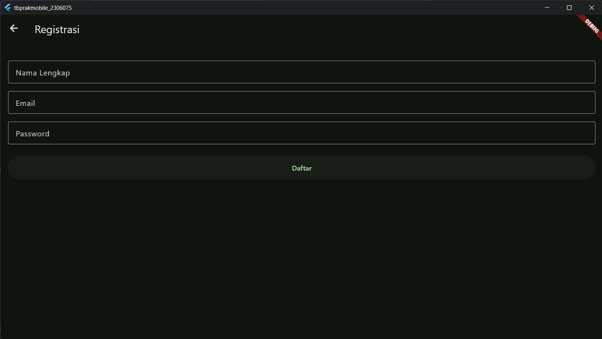
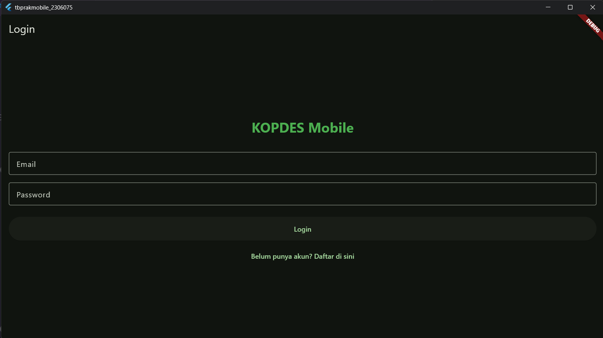
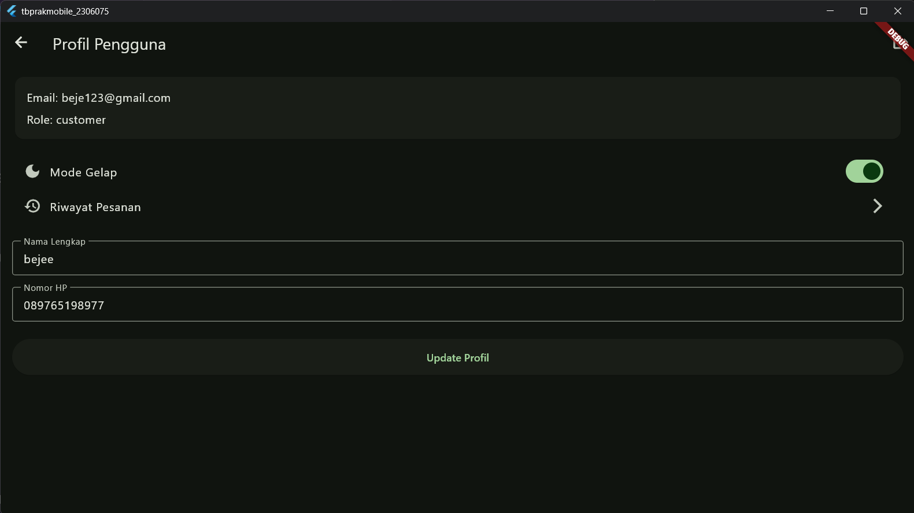
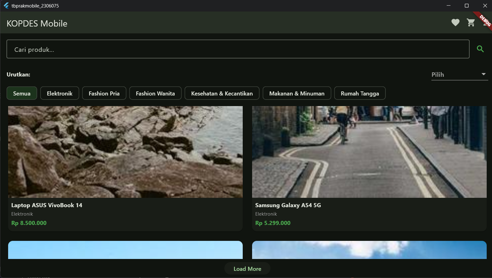
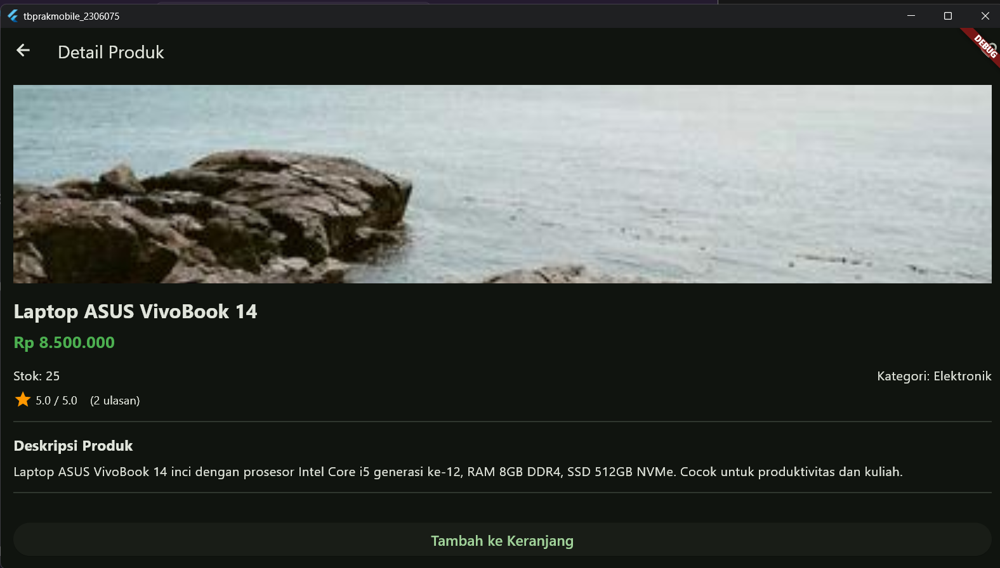
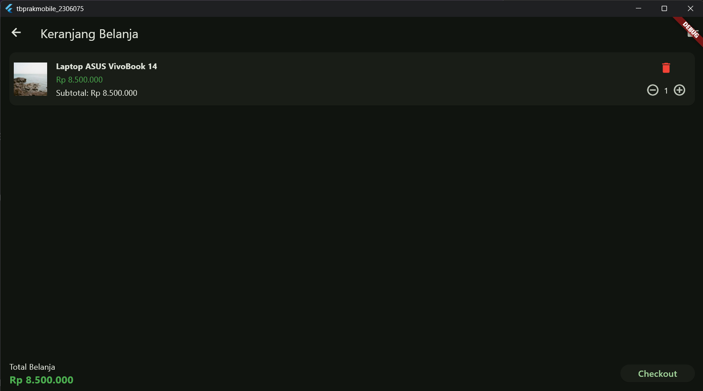
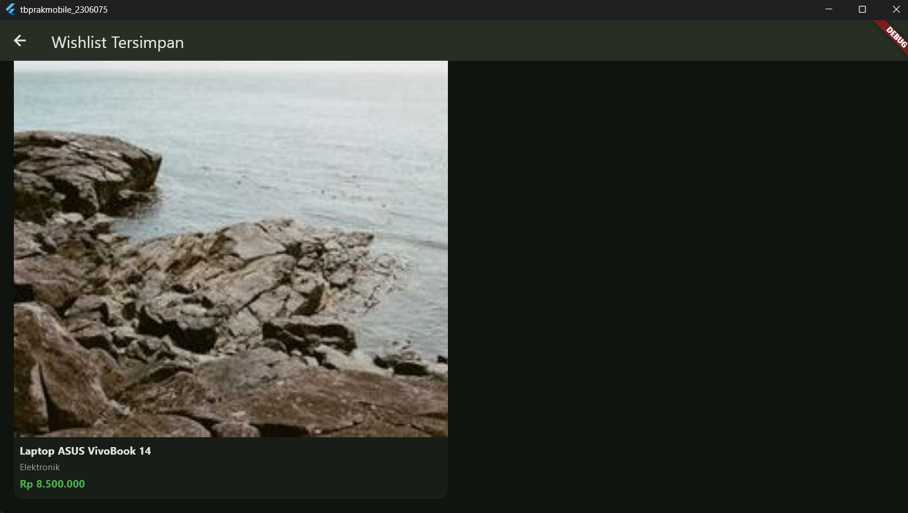
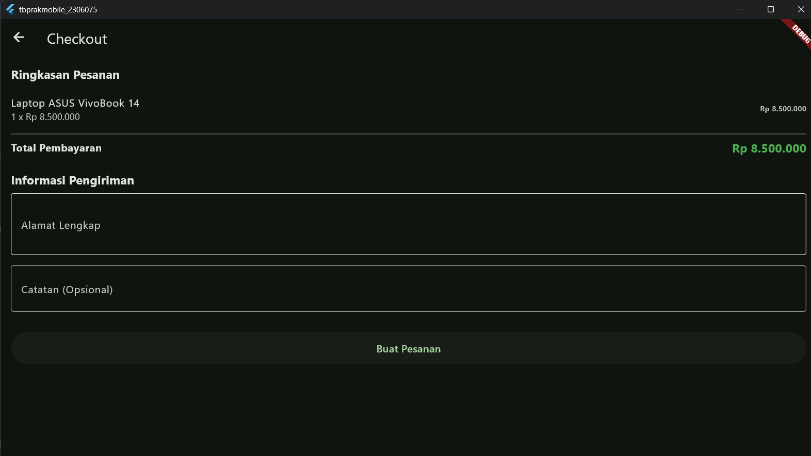

# KOPDES Mobile

Aplikasi Belanja Koperasi Desa Berbasis Flutter.
Proyek ini dibuat untuk memenuhi Ujian Akhir Semester (UAS) mata kuliah Praktikum Mobile.

## Identitas Mahasiswa
- **Nama:** Rizky Bagja N
- **NIM:** 2306075
- **Kelas:** C

## Deskripsi Aplikasi
KOPDES Mobile adalah aplikasi belanja sederhana yang ditujukan untuk keperluan Koperasi Desa. Aplikasi ini menyediakan fitur bagi pengguna untuk mendaftar, login, melihat daftar produk, menyaring berdasarkan kategori, memasukkan barang ke keranjang, proses checkout, serta memantau riwayat pesanan mereka. Aplikasi dirancang menggunakan pola dasar `Provider` dan widget standar Material untuk memenuhi kriteria kode yang sederhana dan bersih.

## Fitur Aplikasi
- **Autentikasi:** Register, Login, dan Logout.
- **Home & Produk:** Menampilkan daftar produk, filter kategori, pengurutan harga/terbaru, dan fitur Load More (Pagination).
- **Detail Produk:** Melihat detail barang, stok, harga, dan ulasan.
- **Keranjang:** Menambahkan barang, mengubah kuantitas, serta badge notifikasi jumlah barang pada ikon keranjang.
- **Checkout:** Mengisi alamat pengiriman, dan notifikasi lokal (local notifications) ketika pesanan sukses.
- **Riwayat Pesanan:** Melihat daftar pesanan yang pernah dibuat beserta detailnya.
- **Wishlist:** Menyimpan produk ke daftar favorit secara offline (menggunakan SharedPreferences).
- **Mode Gelap:** Pengaturan tema terang dan gelap.

## Konfigurasi Base URL & API
Aplikasi ini diatur secara otomatis untuk dapat membaca API backend lokal berdasarkan platform:
- Pada Android Emulator: `http://10.0.2.2:3000/api`
- Pada Windows/Desktop: `http://127.0.0.1:3000/api`

## Cara Menjalankan Backend Lokal
1. Pastikan Anda telah menginstal Node.js.
2. Buka folder backend Anda di terminal.
3. Instal semua dependensi: `npm install`
4. Jalankan server lokal: `npm run start` atau `node index.js` (sesuai instruksi backend Anda).
5. Backend akan berjalan di `localhost:3000`.

## Cara Menjalankan Aplikasi Flutter
1. Pastikan Flutter SDK telah terinstal dengan baik di sistem Anda.
2. Buka proyek ini menggunakan Visual Studio Code atau Android Studio.
3. Unduh semua dependensi:
   ```bash
   flutter pub get
   ```
4. Jalankan aplikasi (pilih emulator Android atau Windows Desktop):
   ```bash
   flutter run
   ```

## Cara Build APK (Release Mode)
Untuk membuat file APK siap rilis:
1. Buka terminal di dalam root proyek ini.
2. Jalankan perintah build:
   ```bash
   flutter build apk --release
   ```
3. File `.apk` akan dihasilkan di dalam direktori: `build/app/outputs/flutter-apk/app-release.apk`
4. Pindahkan APK tersebut ke HP Anda untuk diinstal.

## Screenshot
(Tambahkan screenshot UI KOPDES Mobile di bawah ini dengan format ``)
- 
- 
- 
- 
- 
- 
- 
- 